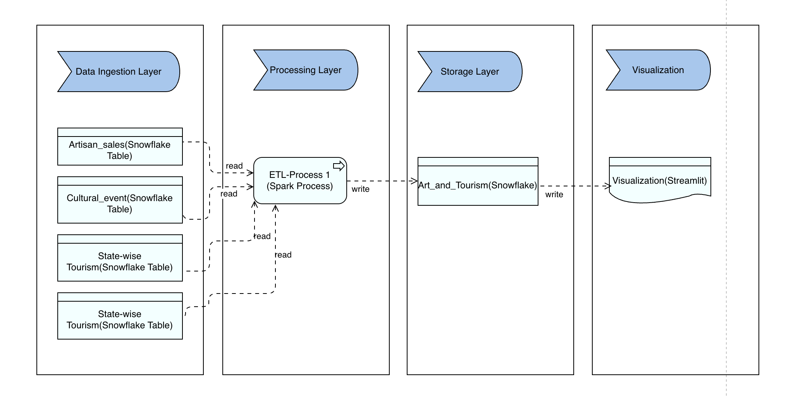

# Art-and-Culture
India's art and culture space is incredibly diverse and rich, encompassing a wide array of traditions and beliefs, influenced by both ancient and modern times, as well as regional, religious and cultural elements. 

# Architecture Diagram

# Data-Model
